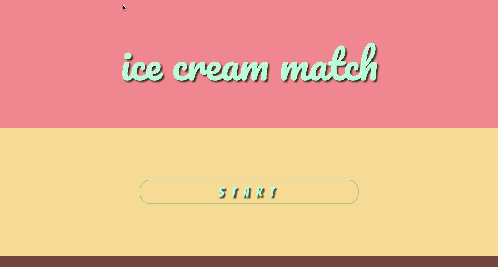

# ice-cream-match

An ice cream themed card matching game

## Technologies Used

- HTML5
- CSS3
- JavaScript (ES5/ES6)

## Live Demo

Try the application live at [http://ice-cream-match.mitchdev.xyz](http://ice-cream-match.mitchdev.xyz)

## Features

- 3 levels of gameplay
- Level 1 : Match all the cards with no limit on attempts
- Level 2 : Match all the cards with a limit of 11 attempts
- Level 3 : Match all the cards with a limit of 8 attempts

## Preview



## Development

#### Getting Started

1. Clone the repository.

    ```shell
    git clone https://github.com/mitchdotdeveloper/ice-cream-match
    cd ice-cream-match
    ```

1. Open the application in your browser.

    ```shell
    open index.html
    ```
